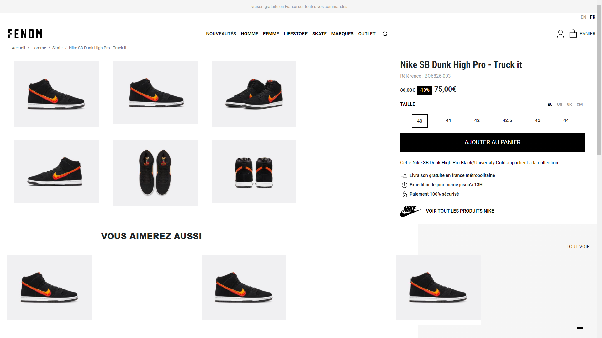
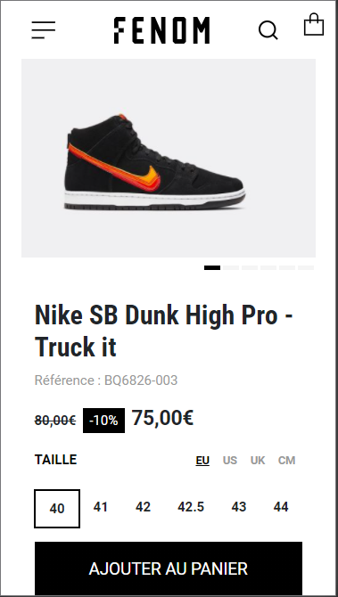

# Site e-commerce

Il s'agit d'un theme customisé de WordPress, pour un exemple de site e-commerce de vetements et accessoires de mode.

## Technologies utilisées :

- WordPress
- Bootstrap 4
- HTML/SCSS
- JQuery
- Composer

### Version desktop
 

### Version mobile
 
